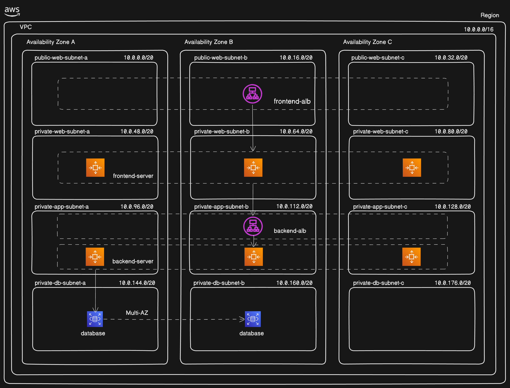

# AWS Three-Tier Architecture Deployment Project

## 👨‍💻 Built & Deployed By

**Deepak Misal**

---

## 📌 Project Overview

I designed and deployed a complete **Three-Tier Architecture on AWS** as part of my hands-on AWS and DevOps learning journey.

The project demonstrates how a scalable web application can be deployed using separate Web, Application, and Database layers while following cloud networking and high-availability best practices.

The entire infrastructure was manually configured and tested in AWS, including networking, compute resources, load balancing, auto scaling, and database connectivity.

---

## 🏗️ Architecture Diagram



---

## ☁️ AWS Services Used

* Amazon VPC
* Public & Private Subnets
* Internet Gateway (IGW)
* NAT Gateway
* Route Tables
* Security Groups
* EC2 Instances
* NGINX Web Server
* PHP Application Server
* Application Load Balancer (ALB)
* Auto Scaling Groups (ASG)
* Amazon RDS MySQL

---

## 🧠 My Implementation Work

### Networking

* Created a custom VPC
* Configured Public and Private Subnets
* Configured Route Tables
* Attached Internet Gateway
* Created NAT Gateway
* Configured Security Groups

### Web Tier

* Launched EC2 instances
* Installed and configured NGINX
* Configured Frontend Load Balancer
* Created Auto Scaling Group

### Application Tier

* Configured PHP Application Server
* Created Backend Load Balancer
* Configured Backend Auto Scaling Group

### Database Tier

* Created Database Subnet Group
* Deployed Amazon RDS MySQL
* Connected Application Tier with Database

---

## ⚠️ Challenges Faced & Resolved

* CIDR overlap errors during subnet creation
* NAT Gateway dependency issues
* Security Group communication problems
* NGINX configuration troubleshooting
* EC2 to RDS connectivity issues
* Load Balancer target registration issues

---

## 📸 AWS Implementation Evidence

The repository contains screenshots of:

* VPC Setup
* Subnet Configuration
* Route Tables
* Internet Gateway
* NAT Gateway
* EC2 Instances
* NGINX Configuration
* Load Balancer
* Auto Scaling Group
* Amazon RDS

Screenshots are available in:

```text
/Screenshot
```

---


## 🚀 Key Learnings

* AWS Networking (VPC, Subnets, Routing)
* High Availability Architecture Design
* Load Balancing and Traffic Distribution
* Auto Scaling and Fault Tolerance
* Multi-Tier Application Architecture
* Cloud Infrastructure Troubleshooting
* AWS Security Best Practices

---

## 🎯 Project Outcome

Successfully deployed a scalable and highly available Three-Tier Architecture on AWS using industry-standard cloud services and networking principles.

This project strengthened my understanding of AWS infrastructure, cloud networking, application deployment, load balancing, auto scaling, and database integration.

---

## 📜 License

This project is intended for educational, learning, and portfolio purposes.
